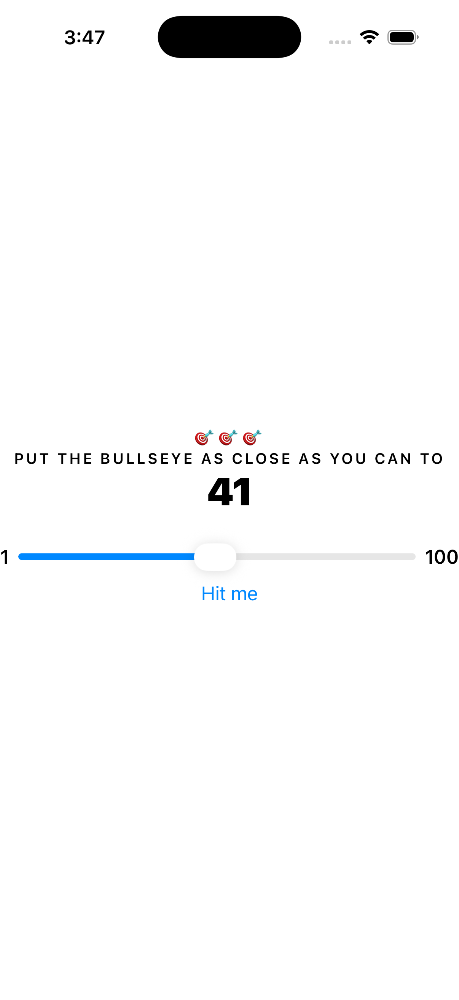
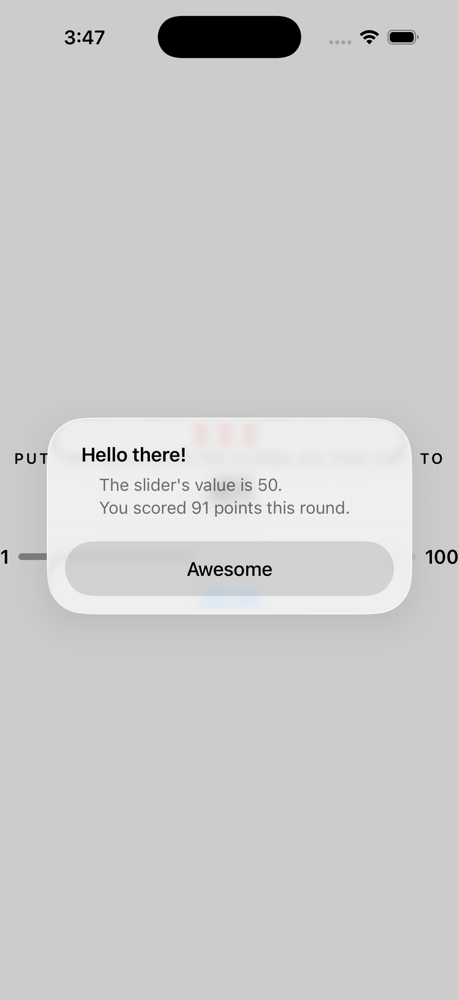

# Bullseye 🎯

Bullseye is a small iOS game app built while following the Kodeco (formerly Ray Wenderlich) *iOS Apprentice / SwiftUI* learning track. The goal is to practice SwiftUI fundamentals and iOS testing by building a simple, complete app with a scoring system and unit tests.

## What the app does

- The app generates a random **target value**
- You move a **slider** to match the target as closely as possible
- You tap **Hit Me** to lock in your guess and receive a score
- You can play multiple rounds and track your total score

## Tech stack

- **Swift**
- **SwiftUI**
- **Xcode**
- **XCTest (Unit Tests)**

## Key concepts practiced

- SwiftUI view composition
- State management (`@State`)
- Simple game logic (rounds, scoring, random targets)
- Basic UI styling and app assets
- Unit testing with XCTest (verifying scoring + game rules)

## Project structure

- `Bullseye/` — app source code (SwiftUI views + game logic)
- `BullseyeTests/` — unit tests (XCTest)

## Tests

This project includes unit tests to validate game logic (for example: scoring rules and round resets).

Run tests in Xcode:
1. Open the project in Xcode
2. Select the **BullseyeTests** scheme (or keep Bullseye and run tests)
3. Press **Cmd + U** to run tests

## Screenshots
# Bullseye 🎯

Bullseye is a small iOS game app built while following the Kodeco (formerly Ray Wenderlich) *iOS Apprentice / SwiftUI* learning track. The goal is to practice SwiftUI fundamentals and iOS testing by building a simple, complete app with a scoring system and unit tests.

## What the app does

- The app generates a random **target value**
- You move a **slider** to match the target as closely as possible
- You tap **Hit Me** to lock in your guess and receive a score
- You can play multiple rounds and track your total score

## Tech stack

- **Swift**
- **SwiftUI**
- **Xcode**
- **XCTest (Unit Tests)**

## Key concepts practiced

- SwiftUI view composition
- State management (`@State`)
- Simple game logic (rounds, scoring, random targets)
- Basic UI styling and app assets
- Unit testing with XCTest (verifying scoring + game rules)

## Project structure

- `Bullseye/` — app source code (SwiftUI views + game logic)
- `BullseyeTests/` — unit tests (XCTest)

## Tests

This project includes unit tests to validate game logic (for example: scoring rules and round resets).

Run tests in Xcode:
1. Open the project in Xcode
2. Select the **BullseyeTests** scheme (or keep Bullseye and run tests)
3. Press **Cmd + U** to run tests

## Screenshots

